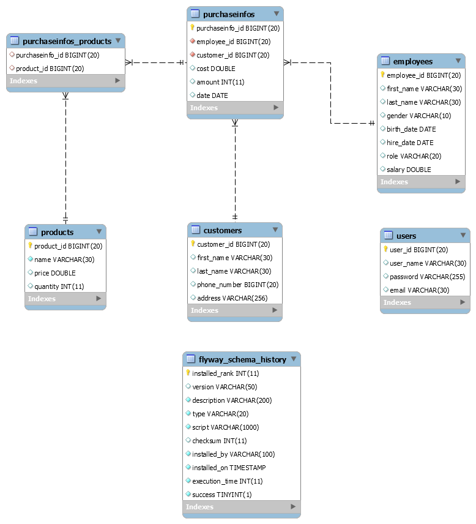

# Shop Management

## Overview

The following repo contains a shop-management application.

Main purpose of this application is to maintain workflow of a shop.

### Used technologies:

   Spring Boot, Spring Security Basic, Spring Security JwtToken, Maven, FlyWay, MySql, Jenkins, Docker.

### ER Diagram

## Guidelines

1. Clone this repository

2. Install MySql database on locale machine and make appropriate configurations to connect application to database

3. Install Postman

4. Install NewMan

5. Install JMeter

6. Install Jenkins

7. Install Docker

## How to start application

### FlyWay

to populate database run from terminal:

**mvn flyway:clean**

**mvn flyway:migrate**

### Application

After successful execution run the application from terminal:

**mvn spring-boot:run**

### How to pull image from Docker registry and run using Docker Compose

**$ docker pull shop-management**

**$ docker-compose --file docker-compose.yml up --detach**
